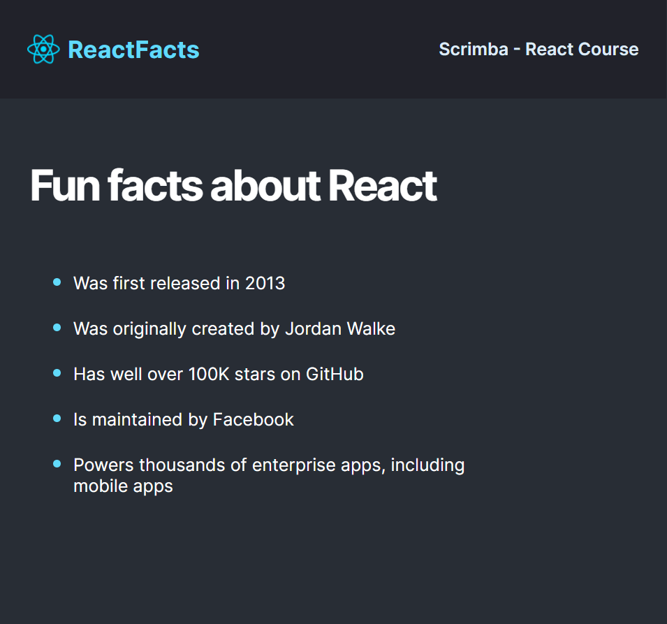

# Challenge "ReactFacts"

## Table of Contents

- [Challenge "ReactFacts"](#challenge-reactfacts)
  - [Table of Contents](#table-of-contents)
  - [Details](#details)
  - [Screenshot](#screenshot)
  - [Links](#links)
  - [Built with](#built-with)
  - [Author](#author)

## Details 

- Create a `components` folder
- Create the following components in separate files inside
  the components folder.  In each one, just render an `h1` 
  with the name of the component (e.g. return Navbar goes here):
    - Navbar
    - Main
- Create an App component outside the components folder (sibling to
  the index.js file)
    - Have App render the Navbar and Main components
- Import and render the App component inside of index.js using ReactDOM
    - At this point you should have your "Navbar goes here" etc. showing up
      in the mini-browser.
- Go to Google fonts and get the "Inter" font with weights 400, 600, and 700.
  Put the links to those fonts ABOVE the style.css link in index.html (Use
  the `<link/>` elements instead of the @import or npm options for getting
  the fonts. You may need to do some extra research to figure out how this 
  works if you haven't done it before)

## Screenshot

## Links

- Repo: [https://github.com/creativoma/react-facts](https://github.com/creativoma/react-facts)
- Deploy: [https://react-facts-bice.vercel.app](https://react-facts-bice.vercel.app)

## Built with

- HTML5
- CSS3 
- Moderm Javascript
- React & ReactDOM
- Vite.js

## Author

- Github: [https://github.com/creativoma](https://github.com/creativoma)
- Linkedin: [https://www.linkedin.com/in/ma-marianoalvarez/](https://www.linkedin.com/in/ma-marianoalvarez/)
